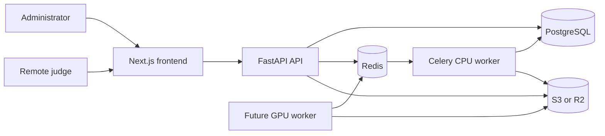

# YoYoVision: Next Steps for Going Online

This document outlines how to deploy YoYoVision for an initial online beta and let remote judges contribute technical clicks and Freestyle Evaluation scores.

## Recommended deployment

Use a managed setup for the first public beta:

| Component | Recommended service |
| --- | --- |
| Next.js frontend | Vercel |
| FastAPI API | Render web service |
| Celery CPU worker | Render background worker |
| Database | Managed PostgreSQL |
| Queue and shared rate limiting | Managed Redis |
| Video storage | AWS S3 or Cloudflare R2 |
| DNS and HTTPS | Cloudflare |

Use separate public domains:

- `app.yoyovision.com` for the frontend, administration pages, and judge pages.
- `api.yoyovision.com` for the FastAPI service.

A GPU worker can be added later through RunPod, Modal, AWS, or another GPU provider. The current trick-event detector is still a mock, so a GPU service is unnecessary for the first judging beta.

## Production configuration

Configure production services with environment variables similar to the following. Never commit real credentials or secrets.

```env
ENVIRONMENT=production

NEXT_PUBLIC_API_BASE_URL=https://api.yoyovision.com
API_CORS_ORIGINS=https://app.yoyovision.com
JUDGE_INVITE_BASE_URL=https://app.yoyovision.com/judge

DATABASE_URL=postgresql+asyncpg://...
REDIS_URL=redis://...
CELERY_BROKER_URL=redis://...
CELERY_RESULT_BACKEND=redis://...

STORAGE_BACKEND=s3
S3_BUCKET=yoyovision-production
S3_REGION=...
S3_ACCESS_KEY_ID=...
S3_SECRET_ACCESS_KEY=...
S3_ENDPOINT_URL=...
S3_SIGNED_URL_EXPIRE_SECONDS=900

AUTH_JWT_SECRET=<long-random-secret>
```

`NEXT_PUBLIC_API_BASE_URL` must be supplied while building the frontend because Next.js exposes it as a build-time public variable.

## Remote judge workflow

The application already supports private judge invitations:

1. Sign in as an administrator.
2. Upload the competition videos.
3. Open **Judging**.
4. Create a judging entry and select its videos.
5. Add every judge by name.
6. Use **Share** to copy the judge's private URL or display its QR code.
7. Send each judge their individual link.
8. The judge opens `/judge/{private-token}` without creating an account.
9. The judge watches the routine, records positive and negative technical clicks, completes the Freestyle Evaluation, and submits it.
10. The head judge reviews the panel results and locks the judging entry.

Every judge must receive a different invitation link. Invite tokens are stored as hashes, expire after 48 hours, and can be rotated or revoked by an administrator.

## Production work required before launch

### 1. Replace development authentication

The current administrator login is an MVP development implementation. Replace it with Clerk, Auth0, Supabase Auth, or another production identity provider. The production system needs:

- Secure administrator provisioning.
- Role-based access for administrators and head judges.
- Password reset or identity-provider recovery.
- Short-lived sessions and secure refresh handling.
- An audit trail for privileged actions.

### 2. Improve video delivery

Judge playback currently retrieves the whole video through FastAPI and creates a browser blob. This will consume API memory and bandwidth when several remote judges watch at once.

Change production playback to short-lived S3-compatible signed URLs with HTTP Range support. This lets a judge seek through the routine without downloading the complete file and allows object storage to serve the video directly.

The API must verify the judge token and video assignment before issuing a signed URL. Signed URLs should expire quickly and must never expose permanent public access to the bucket.

### 3. Create a production frontend image

The current frontend Dockerfile runs the Next.js development server. Create a multi-stage production image that runs:

```bash
npm ci
npm run build
npm run start
```

Remove development bind mounts, hot reload, and `.next` development volumes from the production deployment.

### 4. Move rate limiting to Redis

Judge rate limits currently live in API process memory. That state is lost on restart and is not shared across multiple API instances.

Store token and IP rate-limit counters in Redis. Maintain the higher click limit required for live technical judging while applying stricter limits to invite resolution, video authorization, and score submission.

### 5. Add direct multipart uploads

Large video files should upload directly from the browser to object storage with short-lived multipart upload credentials. The API should:

1. Authenticate the administrator.
2. Create a pending video record.
3. Issue constrained upload credentials.
4. Validate the completed object, MIME type, size, and duration.
5. Mark the video ready and dispatch analysis.

This avoids routing files of up to 500 MB through the API process.

### 6. Add operational safeguards

Before inviting external judges, configure:

- Automated PostgreSQL backups and a tested restore process.
- Private object-storage buckets and lifecycle rules.
- Error monitoring and structured log collection.
- API and worker health checks.
- Alerts for failed analyses and unavailable services.
- Secret rotation and separate staging/production credentials.
- Token redaction in application and proxy logs.
- Privacy terms, retention rules, and video-rights confirmation.
- Database migrations as a controlled release step.

## Deployment topology



The database, Redis, and object-storage endpoints should remain private where the hosting provider supports private networking. Only the frontend and API need public HTTPS endpoints.

## Release stages

### Stage 1: Private staging

- Deploy an isolated staging environment.
- Test upload, analysis, judge invitation, video seeking, click recording, FE submission, head-judge review, token rotation, and locking.
- Test on desktop and mobile networks.
- Verify that judges cannot access videos outside their assignment.

### Stage 2: Invitation beta

- Invite 5–20 known judges.
- Run several complete practice competitions.
- Monitor playback failures, click latency, submission failures, and judge confusion.
- Confirm database backups and recovery before storing important results.

### Stage 3: Public judging

- Complete production authentication and administrator roles.
- Finish signed video playback and multipart uploads.
- Load-test concurrent judge playback and technical clicks.
- Publish privacy, retention, and competition-use policies.
- Keep AI results in comparison or shadow mode until trained models pass a locked evaluation set.

## Estimated initial operating cost

A small beta using one API instance, one CPU worker, managed PostgreSQL, managed Redis, and object storage will commonly fall around **US$50–150 per month**. Actual cost will depend heavily on video storage, bandwidth, retention, backups, and provider pricing. GPU inference is additional and should be introduced only after a real trained checkpoint is ready.

## Recommended implementation order

1. Production frontend build and deployment configuration.
2. Managed PostgreSQL, Redis, and S3-compatible storage.
3. Production administrator authentication.
4. Signed video playback with Range support.
5. Redis-backed rate limiting.
6. Direct multipart video uploads.
7. Monitoring, backups, audit logging, and staging tests.
8. Invitation-only judging beta.
9. GPU inference and trained-model deployment when real checkpoints are available.

The first online release should focus on dependable human judging and data collection. AI scoring should remain clearly labeled as experimental and separate from official human results until it is evaluated against an adjudicated, player-separated test set.
